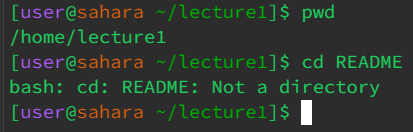

# CSE 15L: Lab Report 1 - Remote Access and FileSystem (Week 1)
## Due Tuesday, Janurary 15th, 2024. - Sandul Henry

---

```
[user@sahara ~/lecture1]$ cd
[user@sahara ~]$
```
* /home/lecture1
* The output returned me to the home directory, when I ran `cd` with no arguements. There was nothing passed as an argument, so this might be the default action for `cd`
* This is not an error. This action could be useful for users to quickly jump back to the home directory.

```
[user@sahara ~]$ cd lecture1/
[user@sahara ~/lecture1]$
```
* /home/
* Passing a directory as an arguement changed the working directory to that location. `lecture1` was a file directory contained in the initial working directory, so you could move straight to it.
* It is not an error, as i changed directories as intended



* Working Directory: `/home/lecture1/`
* In that directory, README was a file. You can't change directories into a file.
* This was an error, because nothing happened and the process didn't change the working directory. 
