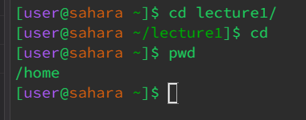
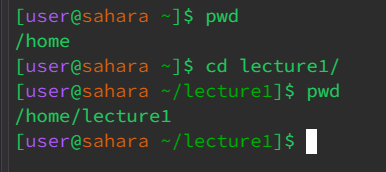
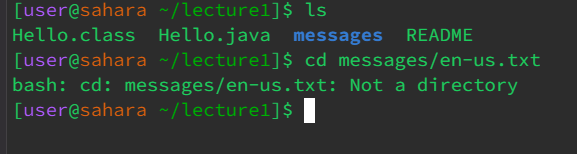
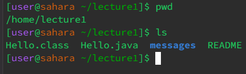
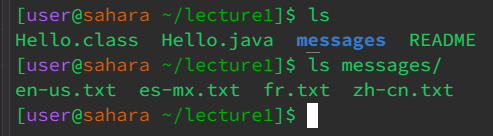
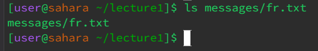
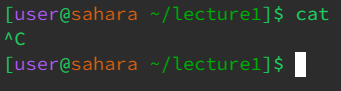
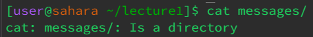
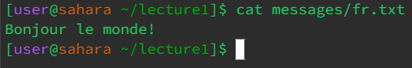

# CSE 15L: Lab Report 1 (Week 1)
## Due Tuesday, Janurary 15th, 2024. - Sandul Henry

---

* The working directory was `/home/lecture1`
* The working directory contained both files and folders, and nothing was outputted when there was no arguement. However, the working directory was changed back to home, which is a deafult action.
* This actions was not an error

* The working directory was `/home`
* The working directory was changed to the directory inputted, as it should 'change directory' to the provided arguement.
* This is not an error

* The working directory was `/home/lecture1`
* The system doesn't let you change directories into a file. `cd` needs a valid directory to change to, from the current working directory or starting from home
* This is an error, because the user used the command with the wrong syntax

---

* The working directory was `/home/lecture1`
* The command `ls` with no arguements will list the files and subdirectories of the current working directory. It printed out those objects, as no arguements would be a default action.
* The output is not an error

* The working directory was `/home/lecture1`
* When a subdirectory is provided as an arguement, `ls` will print the contents of that directory, but won't change into that subdirectory. The files/directories printed were contained in the arguement's path
* This is not an error

* The working directory was `/home/lecture1`
* The `ls` command, when provided a file as an argument, lists the path to that file. This is because there are no contents under that file.
* This output is not an error.

---

* the working directory was `/home/lecture1`
* The `cat` command took me to an output where it just repeated what was typed and needed to be cancelled (`^C`) to exit. Without an arguement, you can't concatenate anything.
* This is not an error because it is a default action with no input.

* The working directory was `/home/lecture1`
* `cat` tries to read a file and print it, but when a directory was provided there is nothing to read.
* This is an error because there was an invalid input

* The working directory was `/home/lecture1`
* The output was a result of the contents of the file provided as an arguement. It concatenates the contents of the files passed as an arguement and prints as readable text.
* This output was not an error.
