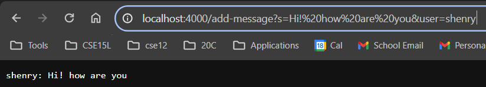
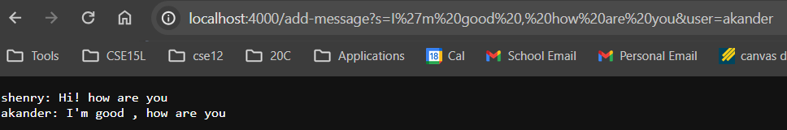
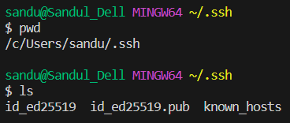
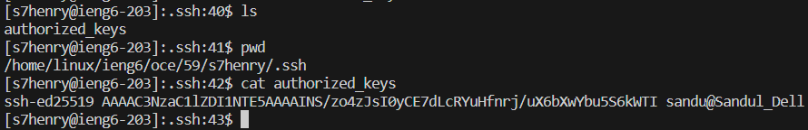

# Lab Report 2 - Servers and SSH Keys (Week 3)
## CSE15L WI24 - by Sandul Henry
---

## Code for ChatServer.java - 
```
import java.io.IOException;
import java.net.URI;

class Handler implements URLHandler {
    // The one bit of state on the server: a number that will be manipulated by
    // various requests.
    String masterString = "";

    public String handleRequest(URI url) {
        if (url.getPath().equals("/add-message")) {
            String msg1 = "", msg2 = "";
            String[] parameters = url.getQuery().split("&");
            if (parameters[0].substring(0, 1).equals("s")) {
                msg1 = parameters[0].split("=")[1];
            }
            if (parameters[1].substring(0, 4).equals("user")) {
                msg2 = parameters[1].split("=")[1];
            }

            String consolidated = msg2 + ": " + msg1 + "\n";
            
            masterString = masterString.concat(consolidated);
            return masterString;
        } else if(url.getPath().equals("/")){
            return "Home Page: \n" + masterString;
        }

        return "404";
    }
}
class ChatServer {
    public static void main(String[] args) throws IOException {
        if(args.length == 0){
            System.out.println("Missing port number! Try any number between 1024 to 49151");
            return;
        }

        int port = Integer.parseInt(args[0]);

        Server.start(port, new Handler());
    }
}
```



* The method `handleRequest(URI url)` is called
* The arguement to that method was the url, `/add-message?s=Hello&user=jpolitz`.
* This expanded the `masterString` field, and updated it.
* The method breaks down the provided query in the url into a user, "jpolitz" and a message, "Hello". These are then added to the master string in the format `jpolitz: Hello`. That way, the master string can be returned and printed on site.



* The method `handleRequest(URI url)` is called
* The arguement to that method was the url, `/add-message?s=How are you&user=yash`.
* This expanded the `masterString` field, and updated it. At this point, the `masterString` already has a value of `jpolitz: Hello` 
* The method breaks down the provided query in the url into a user, "yash" and a message, "How are you". These are then added to the master string in the format `yash: How are you`. That way, the master string can be updated with concat() and returned to the website.

---

## Part 2:

The absolute path to the private key for your SSH key for logging into ieng6:


The absolute path to the public key for your SSH key for logging into ieng6:


A terminal interaction where you log into your ieng6 account without being asked for a password:


---

## Part 3:

I didn't know about the `scp` command. This is a powerful tool for managing files between computers. Before I was aware of this, I didn't know how files could be transferred from machine to machine from a command Line interface. 


